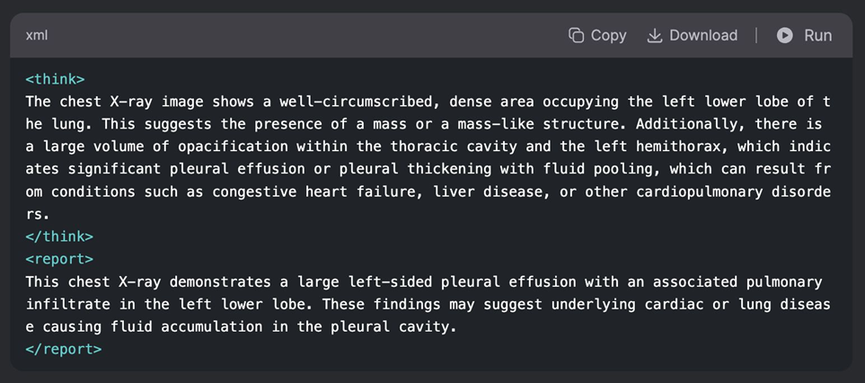

# Multimodal Chest Disease Diagnosis System

> **A Vision-Language AI Framework for Automated, Explainable Radiology Reporting**

## Abstract
Accurate interpretation of chest radiographs is critical for diagnosing thoracic conditions but remains a complex, expertise-driven task. [cite_start]This project introduces the **Multimodal Chest Disease Diagnosis System**, an AI-driven framework that generates structured, radiologist-style reports directly from chest X-ray images[cite: 117, 118]. 

[cite_start]Unlike traditional classifiers that output fixed labels, our system leverages a **fine-tuned Qwen 2.5 7B Vision-Language Model (VLM)** to produce "chain-of-thought" reasoning traces and diagnostic narratives[cite: 119]. [cite_start]By combining **Supervised Fine-Tuning (SFT)** on a hybrid dataset with **Reinforcement Learning (RL)**, we achieved State-of-the-Art (SOTA) comparable performance in generating linguistically fluent and factually grounded reports[cite: 121, 372].

---

## Key Features
* [cite_start]**Multimodal Architecture:** Utilizes **Qwen 2.5 7B** to process both visual embeddings (X-ray) and textual prompts[cite: 257].
* [cite_start]**Explainable AI (XAI):** Generates a unique `<think>` tag containing reasoning traces alongside the final `<report>`, mirroring a radiologist's diagnostic process[cite: 290, 292].
* [cite_start]**Hybrid Dataset Strategy:** Trained on a combination of expert-authored **OpenI** reports and **2,200+ synthetic reports** generated from the **CheXpert** dataset to overcome data scarcity[cite: 205, 230].
* [cite_start]**Resource-Efficient Training:** Implemented **LoRA (Low-Rank Adaptation)** and **GRPO (Gradient Reprocessed Policy Optimization)** to fine-tune large models on constrained hardware[cite: 189, 405].

---

## System Architecture

The system follows a two-stage training pipeline designed for accuracy and interpretability:

### Phase 1: Supervised Fine-Tuning (SFT)
* **Objective:** Teach the model medical syntax and report structure.
* [cite_start]**Method:** Fine-tuned Qwen 2.5 on the hybrid dataset using Cross-Entropy Loss[cite: 272].
* [cite_start]**Optimization:** Used **LoRA** to update only a subset of parameters, reducing memory footprint[cite: 274].

### Phase 2: Reinforcement Learning (RL) for Factual Consistency
* **Objective:** Eliminate hallucinations and ground the report in visual evidence.
* [cite_start]**Method:** Implemented a custom reward function (`accuracy_reward()`) that scores the output based on alignment between the generated findings and the image features[cite: 288, 300].
* [cite_start]**Algorithm:** Utilized **GRPO** to stabilize gradient flow during policy optimization[cite: 312].

---

## Performance Metrics

We evaluated the system on a held-out test set of 440 samples. [cite_start]The Reinforcement Learning phase yielded consistent improvements across all metrics[cite: 372].

| Metric | Fine-Tuned (SFT) | Post-RL (Final) | Significance |
| :--- | :---: | :---: | :--- |
| **BLEU Score** | 0.83 | **0.84** | [cite_start]High phrase-level fluency [cite: 380] |
| **ROUGE-L** | 0.93 | **0.94** | [cite_start]Strong narrative structure retention [cite: 383] |
| **Reward Score** | — | **0.91** | [cite_start]High factual alignment & reasoning accuracy [cite: 390] |
| **Exact Match** | 0.75 | **0.77** | [cite_start]Strict adherence to report formatting [cite: 386] |

---

## Qualitative Results

The system produces structured outputs containing `Findings`, `Impression`, and `Reasoning Traces`.

*(See full report analysis in the `docs/` folder)*

---

## Tech Stack & Tools
* **Model:** Qwen 2.5 7B (Vision-Language Transformer)
* **Optimization:** LoRA, GRPO (Reinforcement Learning)
* [cite_start]**Compute:** Trained on NVIDIA H100 GPUs (Quad-GPU setup) [cite: 341]
* **Evaluation:** BLEU, ROUGE-L, Custom Reward Function
* [cite_start]**Data Sources:** OpenI (NLM), CheXpert (Stanford) [cite: 232]

---

## Contributors
* **Krishna Singh Rajput**
* **Shivani Chauhan**
* **Nishtha Wagh**
* **Kanishk Tanotra**
* **Sharavanee Dommaraju Padmanabhan**

---

> **Note:** Due to the heavy computational resources required (H100 GPUs) and the nature of this Capstone project, the full codebase and model weights are not publicly hosted in this repository. This repo serves as documentation of the methodology, architecture, and results.